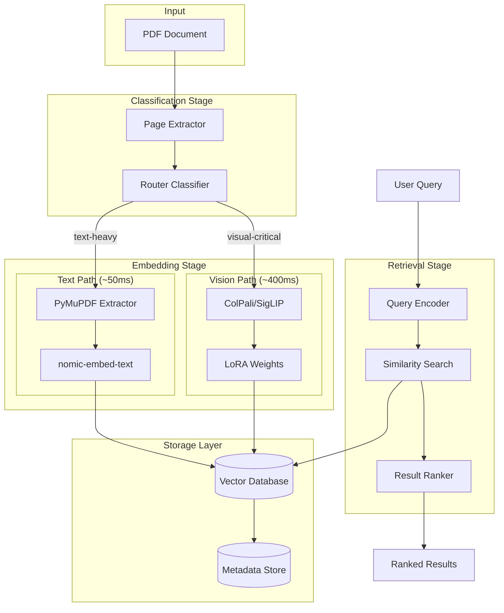
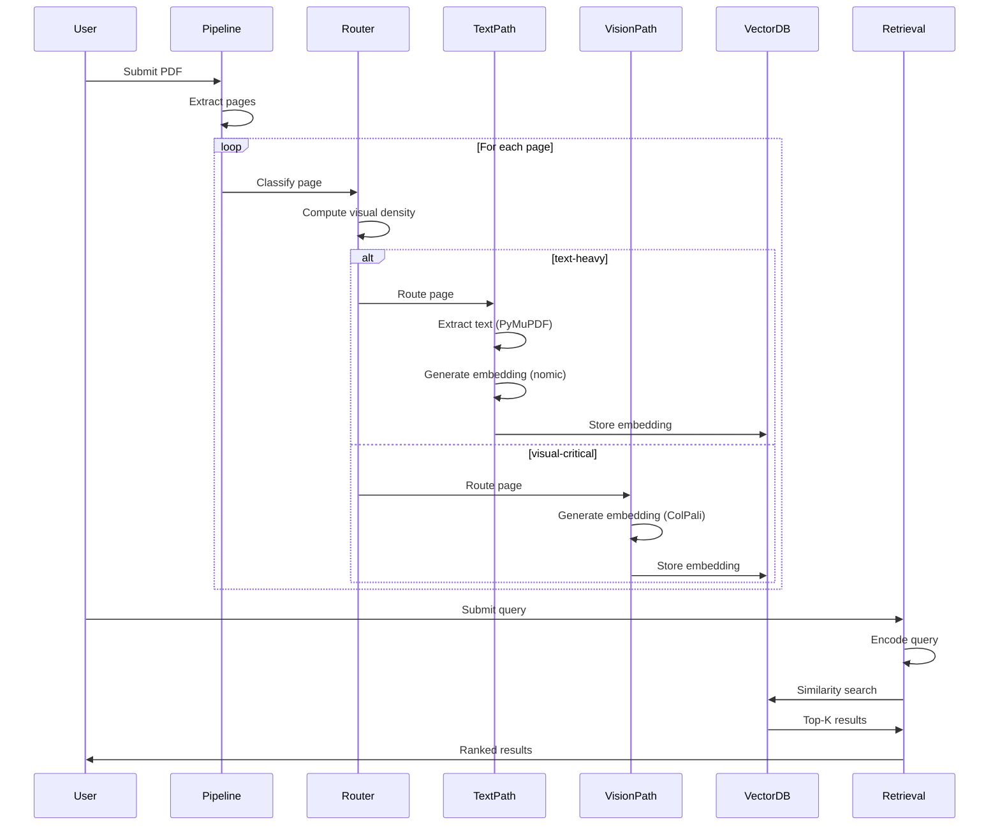

# Design Document: Adaptive Retrieval System

## Overview

The Adaptive Retrieval System implements a modality-adaptive RAG pipeline that intelligently routes document pages to either fast text embedding or high-accuracy vision embedding based on visual complexity. The system targets >90% of ColPali's retrieval accuracy with 50% less latency for technical documentation.

The architecture follows a three-stage pipeline:
1. **Classification Stage**: A lightweight router analyzes page visual density
2. **Embedding Stage**: Pages are processed by either text or vision embedding paths
3. **Retrieval Stage**: Unified search across all embeddings with ranking

Key design decisions:
- Hybrid architecture balances speed (text path) and accuracy (vision path)
- Router uses heuristic-first approach with optional ML classifier
- Vector database abstraction supports multiple backends
- LoRA fine-tuning enables domain adaptation on limited hardware

## Architecture



### Component Interaction Flow



## Components and Interfaces

### Router Component

The Router classifies pages using a two-tier approach:

**Tier 1: Heuristic Classifier (Default)**
- Computes OCR text density using PyMuPDF
- Calculates image area ratio from page layout
- Applies threshold-based classification

**Tier 2: ML Classifier (Optional)**
- DistilBERT-based classifier trained on labeled pages
- Uses visual features extracted from page thumbnails
- Higher accuracy but additional latency (~20ms)

```python
class RouterInterface(Protocol):
    """Interface for page classification router."""
    
    def classify(self, page_image: np.ndarray) -> ClassificationResult:
        """Classify a single page.
        
        Args:
            page_image: Page rendered as numpy array (RGB)
            
        Returns:
            ClassificationResult with modality and confidence
        """
        ...
    
    def classify_batch(self, pages: list[np.ndarray]) -> list[ClassificationResult]:
        """Classify multiple pages.
        
        Args:
            pages: List of page images
            
        Returns:
            List of classification results
        """
        ...

@dataclass
class ClassificationResult:
    modality: Literal["text-heavy", "visual-critical"]
    confidence: float  # 0.0 to 1.0
    features: dict[str, float]  # OCR density, image ratio, etc.
```

### Text Embedding Path

Processes text-heavy pages with fast extraction and embedding:

```python
class TextEmbedderInterface(Protocol):
    """Interface for text embedding path."""
    
    def extract_text(self, page_image: np.ndarray) -> str:
        """Extract text from page image using PyMuPDF.
        
        Args:
            page_image: Page rendered as numpy array
            
        Returns:
            Extracted text with structure preserved
        """
        ...
    
    def embed(self, text: str) -> np.ndarray:
        """Generate embedding using nomic-embed-text.
        
        Args:
            text: Extracted text content
            
        Returns:
            Embedding vector (768 dimensions)
        """
        ...
    
    def process_page(self, page_image: np.ndarray) -> EmbeddingResult:
        """Full pipeline: extract and embed.
        
        Args:
            page_image: Page rendered as numpy array
            
        Returns:
            EmbeddingResult with vector and metadata
        """
        ...
```

### Vision Embedding Path

Processes visual-critical pages with ColPali or fine-tuned SigLIP:

```python
class VisionEmbedderInterface(Protocol):
    """Interface for vision embedding path."""
    
    def embed(self, page_image: np.ndarray) -> np.ndarray:
        """Generate embedding using vision model.
        
        Args:
            page_image: Page rendered as numpy array
            
        Returns:
            Embedding vector (model-dependent dimensions)
        """
        ...
    
    def load_lora_weights(self, weights_path: str) -> None:
        """Load LoRA fine-tuned weights.
        
        Args:
            weights_path: Path to LoRA weights file
        """
        ...
    
    def process_page(self, page_image: np.ndarray) -> EmbeddingResult:
        """Full pipeline: embed with vision model.
        
        Args:
            page_image: Page rendered as numpy array
            
        Returns:
            EmbeddingResult with vector and metadata
        """
        ...
```

### Vector Database Interface

Abstraction layer supporting multiple backends:

```python
class VectorDBInterface(Protocol):
    """Interface for vector database operations."""
    
    def insert(self, embedding: np.ndarray, metadata: DocumentMetadata) -> str:
        """Insert embedding with metadata.
        
        Args:
            embedding: Vector to store
            metadata: Associated document metadata
            
        Returns:
            Unique ID for the stored embedding
        """
        ...
    
    def search(self, query_embedding: np.ndarray, top_k: int = 10) -> list[SearchResult]:
        """Search for similar embeddings.
        
        Args:
            query_embedding: Query vector
            top_k: Number of results to return
            
        Returns:
            List of search results with scores
        """
        ...
    
    def delete(self, doc_id: str) -> bool:
        """Delete embedding by ID.
        
        Args:
            doc_id: ID of embedding to delete
            
        Returns:
            True if deleted, False if not found
        """
        ...

@dataclass
class DocumentMetadata:
    doc_id: str
    page_number: int
    modality: Literal["text-heavy", "visual-critical"]
    source_file: str
    processed_at: datetime
    
@dataclass
class SearchResult:
    doc_id: str
    page_number: int
    score: float
    modality: str
    metadata: DocumentMetadata
```

### Retrieval Interface

Unified query interface:

```python
class RetrievalInterface(Protocol):
    """Interface for unified retrieval."""
    
    def query(self, text: str, top_k: int = 10) -> RetrievalResult:
        """Execute retrieval query.
        
        Args:
            text: Query text
            top_k: Number of results
            
        Returns:
            RetrievalResult with ranked documents
        """
        ...
    
    def encode_query(self, text: str) -> np.ndarray:
        """Encode query text to embedding.
        
        Args:
            text: Query text
            
        Returns:
            Query embedding vector
        """
        ...

@dataclass
class RetrievalResult:
    results: list[SearchResult]
    query_latency_ms: float
    total_searched: int
```

### Benchmark Framework Interface

```python
class BenchmarkInterface(Protocol):
    """Interface for evaluation framework."""
    
    def evaluate(self, predictions: list[str], ground_truth: list[str]) -> MetricsResult:
        """Compute retrieval metrics.
        
        Args:
            predictions: List of predicted document IDs
            ground_truth: List of relevant document IDs
            
        Returns:
            MetricsResult with all computed metrics
        """
        ...
    
    def measure_latency(self, func: Callable, iterations: int = 100) -> LatencyResult:
        """Measure function latency.
        
        Args:
            func: Function to benchmark
            iterations: Number of iterations
            
        Returns:
            LatencyResult with statistics
        """
        ...

@dataclass
class MetricsResult:
    recall_at_1: float
    recall_at_5: float
    recall_at_10: float
    mrr: float
    ndcg: float
    
@dataclass
class LatencyResult:
    mean_ms: float
    median_ms: float
    p95_ms: float
    std_ms: float
```

## Data Models

### Core Data Structures

```python
@dataclass
class Page:
    """Represents a single document page."""
    image: np.ndarray  # RGB image array
    page_number: int
    source_document: str
    width: int
    height: int

@dataclass
class EmbeddingResult:
    """Result from embedding generation."""
    vector: np.ndarray
    modality: Literal["text-heavy", "visual-critical"]
    processing_time_ms: float
    model_name: str
    extracted_text: str | None = None  # Only for text path

@dataclass
class Document:
    """Represents a full document."""
    doc_id: str
    source_path: str
    pages: list[Page]
    total_pages: int
    processed_at: datetime | None = None

@dataclass
class QueryResult:
    """Single query result."""
    doc_id: str
    page_number: int
    relevance_score: float
    modality: str
    snippet: str | None = None

@dataclass
class BenchmarkDataset:
    """Dataset for benchmarking."""
    name: str
    documents: list[Document]
    queries: list[str]
    ground_truth: dict[str, list[str]]  # query -> relevant doc IDs
    
@dataclass
class ExperimentConfig:
    """Configuration for an experiment run."""
    experiment_id: str
    router_type: Literal["heuristic", "ml"]
    vision_model: str
    text_model: str
    lora_weights_path: str | None
    vector_db_backend: Literal["qdrant", "lancedb"]
    batch_size: int
    random_seed: int
    created_at: datetime

@dataclass
class ExperimentResult:
    """Results from an experiment run."""
    config: ExperimentConfig
    metrics: MetricsResult
    latency: LatencyResult
    throughput_pages_per_sec: float
    router_accuracy: float
    completed_at: datetime
```

### Database Schema

For vector storage, embeddings are stored with the following schema:

| Field | Type | Description |
|-------|------|-------------|
| id | string | Unique embedding ID |
| vector | float[] | Embedding vector |
| doc_id | string | Source document ID |
| page_number | int | Page number in document |
| modality | string | "text-heavy" or "visual-critical" |
| source_file | string | Original file path |
| processed_at | timestamp | Processing timestamp |
| model_name | string | Model used for embedding |

### Configuration Schema

```yaml
# config.yaml
router:
  type: heuristic  # or "ml"
  text_density_threshold: 0.7
  image_area_threshold: 0.3
  ml_model_path: null  # path to DistilBERT weights

text_embedding:
  model: nomic-embed-text
  max_tokens: 8192
  batch_size: 32

vision_embedding:
  model: colpali  # or "siglip"
  lora_weights: null  # path to LoRA weights
  batch_size: 4

vector_db:
  backend: qdrant  # or "lancedb"
  collection_name: adaptive_retrieval
  host: localhost
  port: 6333

hardware:
  device: auto  # "mps", "cuda", "cpu"
  max_memory_gb: 8

experiment:
  random_seed: 42
  checkpoint_interval: 100
  log_level: INFO
```


## Correctness Properties

*A property is a characteristic or behavior that should hold true across all valid executions of a system—essentially, a formal statement about what the system should do. Properties serve as the bridge between human-readable specifications and machine-verifiable correctness guarantees.*

### Property 1: Router Classification Correctness

*For any* page image with known visual characteristics (text density > 70% with minimal diagrams OR containing diagrams/schematics), the Router SHALL classify it correctly as "text-heavy" or "visual-critical" respectively, achieving at least 95% recall on visual-critical pages across the test set.

**Validates: Requirements 1.2, 1.3, 1.4**

### Property 2: Batch Classification Output Consistency

*For any* batch of N page images submitted to the Router, the classification result SHALL contain exactly N ClassificationResult objects, each with a valid modality ("text-heavy" or "visual-critical") and a confidence score in the range [0.0, 1.0].

**Validates: Requirements 1.7**

### Property 3: Text Extraction Structure Preservation

*For any* document page containing structured text (headings, paragraphs, lists), the extracted text from Text_Embedding_Path SHALL preserve the hierarchical structure such that headings appear before their content and list items maintain their ordering.

**Validates: Requirements 2.3**

### Property 4: Embedding Dimension Consistency

*For any* page processed through either Text_Embedding_Path or Vision_Embedding_Path, the resulting embedding vector SHALL have dimensions matching the configured schema (768 for nomic-embed-text, model-specific for vision models), and the dimensions SHALL be consistent across all pages processed by the same path.

**Validates: Requirements 2.4, 3.4**

### Property 5: Vector Database Storage Round-Trip

*For any* embedding stored in the Vector_Database with associated metadata, retrieving that embedding by its ID SHALL return the identical vector values and complete metadata (doc_id, page_number, modality, source_file, processed_at).

**Validates: Requirements 4.1, 4.2**

### Property 6: Embedding Dimension Validation

*For any* embedding submitted to the Vector_Database with dimensions not matching the expected schema, the Vector_Database SHALL reject the insertion and raise a validation error.

**Validates: Requirements 4.5**

### Property 7: Retrieval Result Correctness

*For any* text query submitted to the Retrieval_Interface with top_k parameter K, the result SHALL contain at most K results, each result SHALL include doc_id, page_number, relevance_score, and modality, and results SHALL be sorted in descending order by relevance_score.

**Validates: Requirements 5.1, 5.2, 5.3, 5.4**

### Property 8: Recall Metric Computation

*For any* set of predictions and ground truth relevance labels, the computed Recall@K metric SHALL equal the proportion of ground truth relevant documents that appear in the top K predictions, and Recall@K1 <= Recall@K2 when K1 < K2.

**Validates: Requirements 6.1**

### Property 9: Latency Statistics Computation

*For any* set of latency measurements, the computed statistics SHALL satisfy: min <= mean <= max, min <= median <= max, min <= P95 <= max, and P95 >= median.

**Validates: Requirements 6.2**

### Property 10: Throughput Computation

*For any* processing run with N pages completed in T seconds, the computed throughput SHALL equal N/T pages per second.

**Validates: Requirements 6.3**

### Property 11: Dataset Normalization Consistency

*For any* dataset loaded through Data_Loader (REAL-MM-RAG, DocVQA, ViDoRe), the output SHALL conform to the BenchmarkDataset schema with non-empty documents list, queries list, and ground_truth mapping.

**Validates: Requirements 7.4**

### Property 12: Dataset Caching Round-Trip

*For any* dataset loaded twice through Data_Loader with caching enabled, the second load SHALL return data identical to the first load and SHALL complete faster (using cached data).

**Validates: Requirements 7.5**

### Property 13: Dataset Split Proportions

*For any* dataset split with ratios (train_ratio, val_ratio, test_ratio) where ratios sum to 1.0, the resulting splits SHALL have sizes proportional to the ratios (within rounding tolerance), and the union of splits SHALL equal the original dataset with no duplicates.

**Validates: Requirements 7.6**

### Property 14: Checkpoint Interval Consistency

*For any* fine-tuning run with checkpoint_interval=N, checkpoints SHALL be saved at steps N, 2N, 3N, etc., and each checkpoint SHALL contain valid model weights loadable for resumption.

**Validates: Requirements 8.3**

### Property 15: LoRA Weights Round-Trip

*For any* LoRA weights exported by Fine_Tuning_Pipeline, loading those weights into Vision_Embedding_Path SHALL succeed without errors, and the loaded model SHALL produce embeddings with the same dimensions as the original fine-tuned model.

**Validates: Requirements 8.5**

### Property 16: Training Resume from Checkpoint

*For any* training run interrupted at step S and resumed from checkpoint, the resumed training SHALL continue from step S (not restart from 0), and the final model SHALL be equivalent to an uninterrupted training run.

**Validates: Requirements 8.7**

### Property 17: Hardware Detection Correctness

*For any* system with available hardware (MPS, CUDA, or CPU-only), the automatic hardware detection SHALL correctly identify the available backend and configure PyTorch to use it.

**Validates: Requirements 9.4**

### Property 18: Experiment Reproducibility with Seeds

*For any* experiment configuration with a fixed random seed, running the experiment twice SHALL produce identical results (same metrics, same model outputs for same inputs).

**Validates: Requirements 10.2**

### Property 19: Experiment Persistence Completeness

*For any* completed experiment, the saved results SHALL include the complete ExperimentConfig (experiment_id, router_type, vision_model, text_model, hyperparameters) and ExperimentResult (metrics, latency, throughput).

**Validates: Requirements 10.1, 10.3**

### Property 20: LaTeX Export Validity

*For any* experiment results exported to LaTeX format, the output SHALL be valid LaTeX that compiles without errors and produces a properly formatted table.

**Validates: Requirements 10.5**

## Error Handling

### Router Errors

| Error Condition | Handling Strategy | Fallback |
|----------------|-------------------|----------|
| Corrupted/unreadable page | Log error with page details | Route to Vision_Embedding_Path |
| Classification timeout (>50ms) | Log warning, return result | Continue with delayed result |
| ML model load failure | Log error | Fall back to heuristic classifier |
| Invalid image format | Raise ValueError with details | None (caller must handle) |

### Text Embedding Path Errors

| Error Condition | Handling Strategy | Fallback |
|----------------|-------------------|----------|
| Text extraction failure | Log error | Escalate to Vision_Embedding_Path |
| Empty text content | Log warning | Escalate to Vision_Embedding_Path |
| Embedding model error | Log error, retry once | Raise exception if retry fails |
| Token limit exceeded | Truncate text with warning | Process truncated text |

### Vision Embedding Path Errors

| Error Condition | Handling Strategy | Fallback |
|----------------|-------------------|----------|
| Out of memory | Log error, reduce batch size | Retry with batch_size=1 |
| Model load failure | Log error | Raise exception (critical) |
| LoRA weights incompatible | Log error | Use base model without LoRA |
| CUDA/MPS unavailable | Log warning | Fall back to CPU |

### Vector Database Errors

| Error Condition | Handling Strategy | Fallback |
|----------------|-------------------|----------|
| Connection failure | Retry with exponential backoff | Raise after 3 retries |
| Dimension mismatch | Reject with validation error | None (caller must fix) |
| Storage full | Log error | Raise exception |
| Query timeout | Log warning, return partial | Return available results |

### Data Loading Errors

| Error Condition | Handling Strategy | Fallback |
|----------------|-------------------|----------|
| Download failure | Retry with exponential backoff | Raise after 5 retries |
| Corrupted cache | Delete cache, re-download | Fresh download |
| Invalid dataset format | Log error with details | Raise ValueError |
| Insufficient disk space | Log error | Raise exception |

### Fine-Tuning Errors

| Error Condition | Handling Strategy | Fallback |
|----------------|-------------------|----------|
| Training interrupted | Save emergency checkpoint | Resume from checkpoint |
| GPU memory exhausted | Reduce batch size, retry | Fall back to gradient accumulation |
| Checkpoint save failure | Retry, log error | Continue training (risk data loss) |
| Validation loss spike | Log warning, continue | Early stopping if persistent |

## Testing Strategy

### Dual Testing Approach

The system employs both unit tests and property-based tests for comprehensive coverage:

- **Unit Tests**: Verify specific examples, edge cases, integration points, and error conditions
- **Property Tests**: Verify universal properties across randomly generated inputs

### Property-Based Testing Configuration

**Library**: Hypothesis (Python)

**Configuration**:
```python
from hypothesis import settings, Phase

# Default settings for all property tests
settings.register_profile("default", max_examples=100)
settings.register_profile("ci", max_examples=200, deadline=None)
settings.register_profile("thorough", max_examples=500)
```

**Minimum iterations**: 100 per property test
**Tag format**: `# Feature: adaptive-retrieval-system, Property N: [property_text]`

### Test Categories

#### Router Tests
- **Unit**: Test specific page classifications with known ground truth
- **Property**: P1 (classification correctness), P2 (batch consistency)
- **Edge cases**: Empty pages, corrupted images, extreme aspect ratios

#### Embedding Path Tests
- **Unit**: Test embedding generation for sample pages
- **Property**: P3 (structure preservation), P4 (dimension consistency)
- **Edge cases**: Empty text, very long text, unusual image sizes

#### Vector Database Tests
- **Unit**: Test CRUD operations with sample embeddings
- **Property**: P5 (storage round-trip), P6 (dimension validation)
- **Edge cases**: Concurrent writes, large batches, connection drops

#### Retrieval Tests
- **Unit**: Test query results for known document sets
- **Property**: P7 (result correctness)
- **Edge cases**: Empty corpus, no matching results, duplicate scores

#### Benchmark Tests
- **Unit**: Test metric computation with known values
- **Property**: P8 (recall computation), P9 (latency stats), P10 (throughput)
- **Edge cases**: Empty predictions, perfect recall, zero latency

#### Data Loading Tests
- **Unit**: Test loading each dataset type
- **Property**: P11 (normalization), P12 (caching), P13 (splits)
- **Edge cases**: Network failures, corrupted files, empty datasets

#### Fine-Tuning Tests
- **Unit**: Test checkpoint saving/loading
- **Property**: P14 (checkpoint intervals), P15 (LoRA round-trip), P16 (resume)
- **Edge cases**: Interrupted training, disk full, incompatible weights

#### System Tests
- **Unit**: Test hardware detection on current platform
- **Property**: P17 (hardware detection), P18 (reproducibility), P19 (persistence), P20 (LaTeX export)
- **Edge cases**: No GPU, mixed precision, concurrent experiments

### Integration Testing

End-to-end pipeline tests:
1. Load sample dataset → Process pages → Store embeddings → Query → Verify results
2. Full benchmark run on small dataset subset
3. Fine-tuning → Export → Load → Inference verification

### Performance Testing

- Latency benchmarks for each component
- Memory profiling on M1 Pro (MPS) and T4 GPU
- Throughput testing with varying batch sizes
- Stress testing with large document corpora
