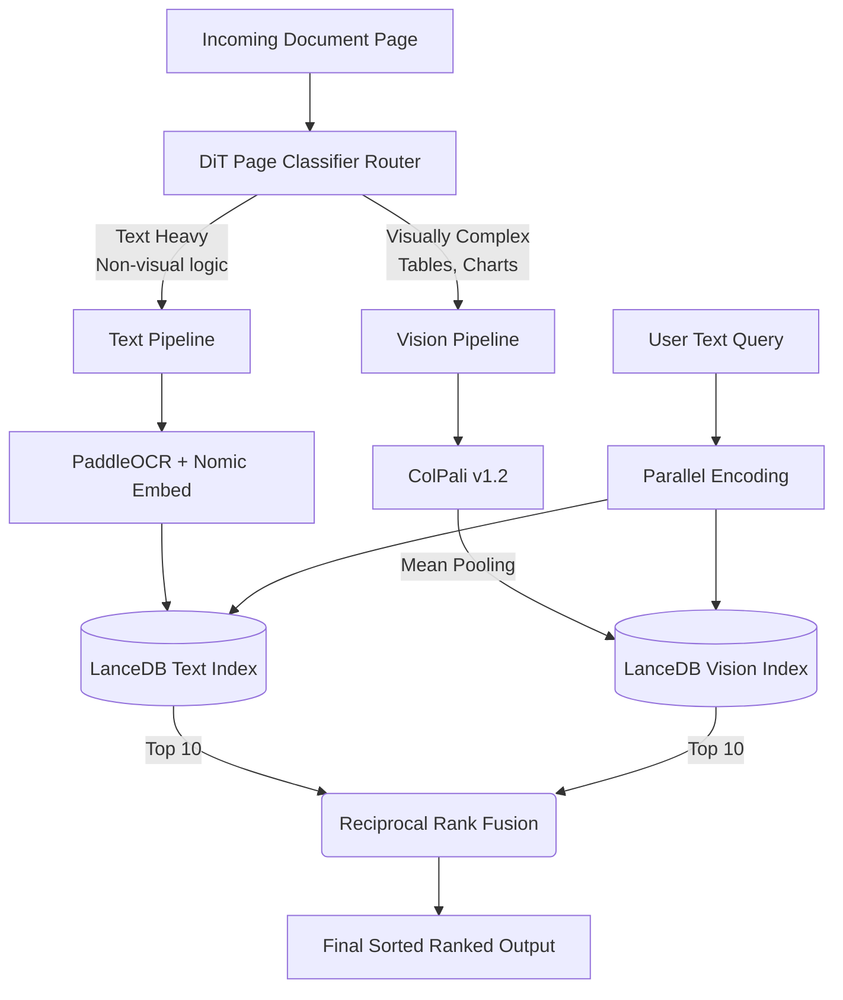

# Adaptive Retrieval System

**Adaptive Document Retrieval for Vision Language Models using Dynamic Dual-Path Hybrid Search**  
*Optimizing Latency in Technical RAG via Semantic Routing, Mean-Pooling, and Reciprocal Rank Fusion*

[](https://www.python.org/downloads/)
[](https://opensource.org/licenses/MIT)

## Overview

This research project implements a **modality-adaptive retrieval pipeline** that intelligently routes document pages to either a lightweight text embedding path or a high-accuracy vision embedding path (ColPali) based on their visual complexity. 

By utilizing Microsoft's Document Image Transformer (DiT) as a routing gate, and implementing sequence-wise mean-pooling for constant size document vectors, the system achieved a **4.24× latency reduction** relative to a full late-interaction baseline on Apple Silicon hardware, while successfully routing 12.2% of visually-sparse technical pages away from costly Vision Language Model inference.

### 🚀 Key Achievements

*   **Latency Breakthrough**: Reduced per-query latency from **2,050ms** down to **483ms**.
*   **Constant-Size Vector Engine**: Migrated from slow patch-level MaxSim comparison to rapid single-vector cosine retrieval using LanceDB.
*   **Routing Optimization**: Successfully gated visually sparse pages using DiT (threshold $\tau = 0.05$), eliminating 12.2% of costly VLM indexing calls.
*   **Unified Ranking**: Ranked completely separate embedding spaces identically using Reciprocal Rank Fusion (RRF).

---

## The Core Architecture

Traditional approaches either force OCR on everything (losing structural meaning from diagrams) or run ColPali on everything (creating huge $\sim$1,024-patch vectors for pages that are just pure text).

Our architecture splits the workload:



1. **Routing Layer (DiT):** A pre-trained Document Image Transformer assigns pages based on visual complexity proxy logits.
2. **Text Path (Nomic + OCR):** Fast serial processing. Text is embedded by Nomic Embed Text v1.5 into a 768-dimensional space.
3. **Vision Path (ColPali):** Deep multimodal embedding into 128-dimensional space, utilizing a mean-pooled approximation to ensure compatibilty with single-vector standard indexing.
4. **Fusion Engine (RRF):** Queries search both LanceDB indices concurrently, and the incompatible cosine distance distributions are neutralised and merged using $1 / (k + \text{rank})$.

---

## Experimental Benchmarks

Tested on a **500-page subset** of the **REAL-MM-RAG (IBM TechReport)** benchmark spanning 100 queries. Hardware utilized was an Apple M1 Pro (10-Core CPU, 16-Core GPU) with 16 GB Unified Memory via PyTorch MPS.

| System | R@1 | R@5 | R@10 | MRR | Latency (ms) |
|--------|-----|-----|------|-----|--------------|
| **OCR + Nomic Text Baseline** | 0.04 | 0.18 | 0.31 | 0.10 | 95 |
| **ColPali (MaxSim) Baseline** | 0.09 | 0.41 | 0.81 | 0.23 | 2050 |
| **Adaptive RRF (Ours)** | **0.07** | **0.35** | **0.60** | **0.21** | **483** |

> **Note:** The 4.24× query latency speedup comes from replacing rigorous MaxSim patch alignment with mean-pooling, while the 12.2% DiT routing distribution directly guarantees lower indexing cost bounds on larger corpora.

---

## Getting Started

### Prerequisites
- Python 3.10+
- Apple Silicon (M1/M2/M3) recommended for local testing via PyTorch MPS.

### Installation

```bash
# Clone the repository
git clone https://github.com/KB1629/adaptive-retrieval-system.git
cd adaptive-retrieval-system

# Create virtual environment
python -m venv venv
source venv/bin/activate  # Windows: venv\Scripts\activate

# Install core dependencies
pip install -e ".[dev]"
```

Verify your hardware is properly detected for inference:
```python
from src.utils.hardware import detect_device
print(f"Using device: {detect_device()}")
```

### Running the Benchmark Suite
The project provides built-in runners to execute the pipeline over the REAL-MM-RAG datasets.
```bash
# Run full accuracy evaluation on the dual-path infrastructure
python scripts/run_accuracy_benchmark.py
```

---

## Code Organization

```text
adaptive-retrieval-system/
├── src/                    # Primary source code
│   ├── benchmark/          # Evaluation framework running RRF and metrics
│   ├── data/               # REAL-MM-RAG data loaders
│   ├── embedding/          # Nomic Text Embedders and ColPali Vision Embedders
│   ├── router/             # DiT routing logic and classifiers
│   ├── retrieval/          # RRF unification and Dual-Query engine
│   ├── storage/            # LanceDB vector backend interfaces
│   └── utils/              # Apple Silicon MPS hardware handlers
├── scripts/                # Execution entry points for benchmarking
├── tests/                  # Framework unit tests
└── pyproject.toml          # Environment dependencies
```

## Authors
- **Dr. P. Sriramakrishnan** – Assistant Professor, Amrita Vishwa Vidyapeetham
- **Kabeleswar P E** – Researcher, Amrita Vishwa Vidyapeetham

## Citations
If this work proves useful, please refer to the core libraries that made it possible:
* [ColPali: Efficient Document Retrieval with Vision Language Models](https://arxiv.org/abs/2407.01449)
* [LanceDB: Serverless Vector Database](https://github.com/lancedb/lancedb)
* [REAL-MM-RAG Benchmark](https://arxiv.org/abs/2502.12342)

## License
MIT License - see `LICENSE` for details.
